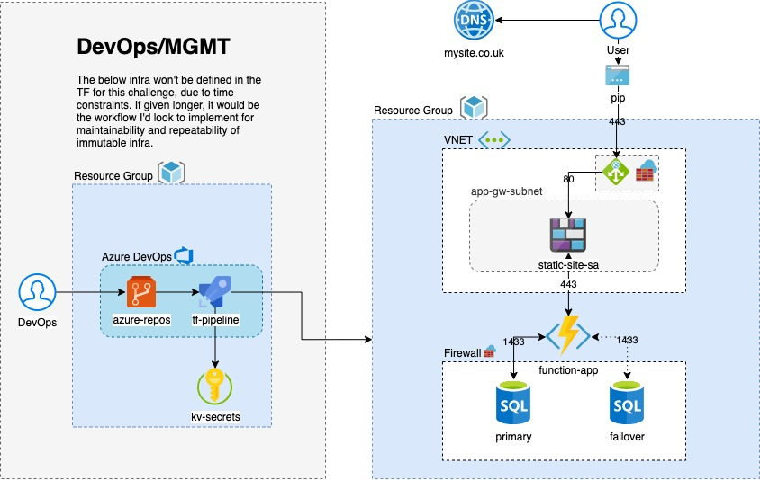

Challenge #1
 
A 3 tier environment is a common setup. Use a tool of your choosing/familiarity create these resources. Please remember we will not be judged on the outcome but more focusing on the approach, style and reproducibility.

# Approach

Initial thoughts are produce an architecture diagram to guide implementation. Want to lean towards Azure and leverage PaaS services for integrated load balancing, auto-scaling, decreased surface area for attack and cost savings.

## Providers and tooling

- Infra: Azure
- IaC: Terraform
    
## Architecture:



### Web tier: either static site hosted in a Storage Account OR a Web App.

  App gateway to enable custom domain for static site hosted on Azure Storage Account, SSL offloading, redirecting HTTP traffic to HTTPS (this could also be achieved with Azure CDN/DNS Zones).

  Azure Storage Accounts now allow static websites to be hosted as blobs. A lot of modern web applications are moving toward the Single-Page Application (SPA) paradigm, where most of the rendering is done via the browser, which means a smoother experience for the user and lower infra requirements. Static content (html, js, css) can be served from the storage account, which means cheaper run costs.

### Middle tier: Azure Function;

  This Azure function will expose endpoints that the front-end web tier can hit over HTTPS, where it will perform required business logic capabilities.

  Azure functions give you 1 million free executions per month for free and very cheap costs thereafter. Serverless compute pattern means no VM patching or maintenance and integrated scaling to deal with fluctauting load. There is a migration path toward an isolated app service environment, if there are greater security requirements.

### Data tier: Azure SQL.

  Azure SQL PaaS will provide the basis for the data tier. Cheap and efficient means of storing structured data. Basic SKU's cost <£5 monthly. PaaS offering also eliminates the challenge of patching / maintenance.

## How to run

First, you'll want to auth with your Azure account, by running:

```az login```

Then run:

```az account set --subscription <your sub identifier here>```

You can then change any of the subscription references to your own environment and the above command will set the context for your terraform to run against.

```terraform init```

This will pull down the providers you require to run the TF.

Then you can run:

```terraform plan -var-file="vars/{env}"```

To preview the output of the TF. And:

```terraform apply -var-file="vars/{env}"```
